# TOGAF® EA — Visual Study Notes

 
> Based on the **TOGAF® Standard, 10th Edition** 

---

## Table of Contents

| # | Section | Key Concept |
|:--|---------|-------------|
| 1 | [What is TOGAF?](#1-what-is-togaf) | Framework overview & four domains |
| 2 | [The ADM Cycle](#2-the-architecture-development-method-adm) | Core phases, iterations, change types |
| 3 | [Architecture Scoping](#3-architecture-scoping) | Breadth, depth, level & EA contexts |
| 4 | [Abstraction Levels](#4-architecture-abstraction-levels) | Contextual → Conceptual → Logical → Physical |
| 5 | [Building Blocks](#5-architecture-building-blocks-abbs--sbbs) | ABBs, SBBs, hierarchy |
| 6 | [Key Deliverables](#6-key-deliverables--artefacts) | A.D.D., I&MP, Roadmap |
| 7 | [RAW vs. SAW](#7-raw-vs-saw) | Scoping & filtering architecture work |
| 8 | [Change Requests](#8-change-requests-driving-adm-cycles) | Eight triggers for new ADM cycles |
| 9 | [Phase E vs. F](#9-phase-e-vs-phase-f-objectives) | Opportunities vs. Migration Planning |
| 10 | [Transition Architecture](#10-transition-architecture-planning) | T1 → T2 → T3 build patterns |
| 11 | [Agile EA](#11-agile-ea-vs-traditional-ea) | Decision matrix |
| 12 | [Security Architecture](#12-enterprise-security-architecture) | Security across the ADM |
| 13 | [Repository & Continuum](#13-repository--enterprise-continuum) | Reuse & storage |
| 14 | [Business Scenarios](#14-business-scenarios) | Capturing requirements |
| 15 | [Viewpoints Library](#15-togaf-ea-viewpoints-library-10th-edition) | Catalogs, matrices, diagrams |
| 16 | [Foundation Metamodel](#16-foundation-metamodel) | Entity relationships |
| 17 | [Content Framework](#17-content-framework-by-adm-phase) | Metamodel levels by phase |
| 18 | [Classes of Engagement](#18-classes-of-architecture-engagement) | Why / when / what |

---

## 1. What is TOGAF?

**TOGAF** (The Open Group Architecture Framework) is a globally recognised framework for practising Enterprise Architecture. Think of it as a comprehensive "how-to guide" for organisations that want to design and manage their business and technology landscape in a structured, repeatable way — rather than making ad-hoc decisions that create complexity over time.

TOGAF is owned and maintained by **The Open Group**, a vendor-neutral consortium. The framework does not prescribe specific tools or technologies; instead it provides a methodology, a vocabulary, and a set of best practices that can be adapted to any organisation. The current version is the **10th Edition**, which expanded the framework's coverage of agile approaches, value streams, and security.

At its core, TOGAF organises an enterprise into **four architecture domains** — Business, Data, Application, and Technology (collectively known as **BDAT**). These four domains represent a complete picture of how an organisation operates and is supported by its technology.

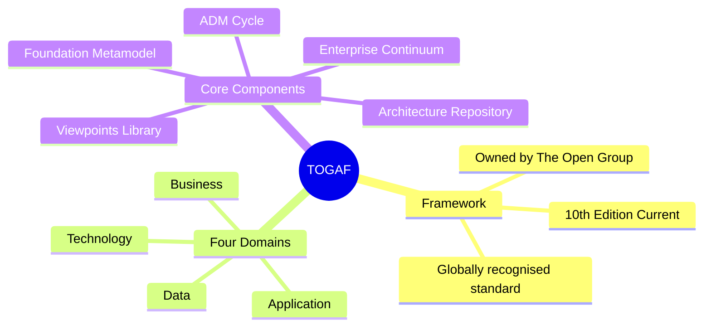

---

## 2. The Architecture Development Method (ADM)

The **ADM** is the heart of TOGAF — a structured, iterative cycle of phases that guides architects through the process of developing, approving, and governing enterprise architecture. Rather than a one-time project, the ADM is designed to be repeated continuously as the organisation evolves.

The cycle begins with the **Preliminary phase** (setting up the EA capability), moves through phases A to H (vision, design, implementation, and governance), and loops back to Phase A whenever a new architectural challenge arises. **Requirements Management** sits at the centre of the wheel and feeds into every phase — it is not a phase itself but a continuous process that ensures architecture work always traces back to real business needs.

The key insight of the ADM is that architecture is never "done." Every significant change — a new business strategy, a technology shift, a merger — triggers a new pass through the cycle, starting at whichever phase is appropriate for the scale of the change.

### ADM Phase Flow


### ADM Iteration Types

Not every change requires running all phases from scratch. The ADM defines **four iteration types** that allow architects to re-enter the cycle at the right level of scope. A small technology update might only need a Governance Iteration, while a major strategic shift could require a full Architecture Development Iteration from Phase A.

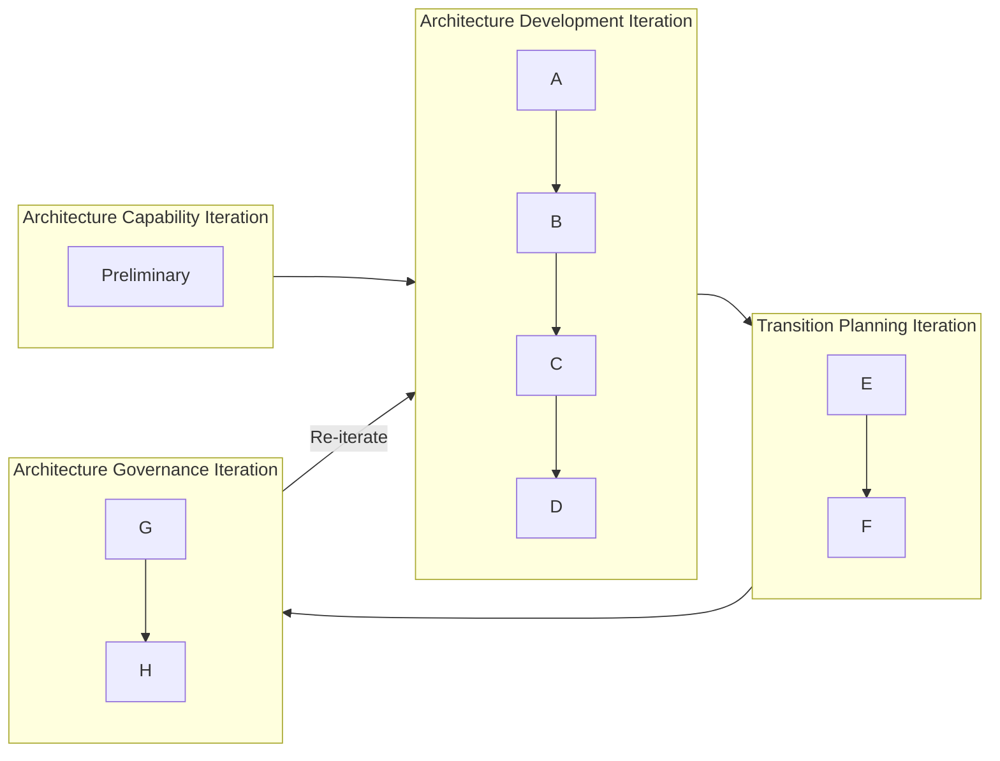

### Reiteration & Change Types

When a change request arrives, the architect must first classify it to determine how far back in the ADM cycle to go. A **Simplification** change (e.g. removing a redundant application) may only need a single-phase rework. A **RE-Architecture** change (e.g. moving from on-premises to cloud) could require starting again from Phase A or even the Preliminary phase to revisit principles and governance.

| Change Type | Description | ADM Impact |
|---|---|---|
| **RE-Architecture** | Major structural change | Back to Phase A or Preliminary |
| **Large Incremental** | More than one phase rework | Multi-phase reiteration |
| **Simplification** | Small incremental change | Rework within a single phase |
| **General Change Management** | Ongoing governance | Phases G & H |

> **Phase G** handles: process reviews, audits, compliance assessments, disciplinary processes, dispensations, exemptions.
>
> **Phase H** handles: re-architecture decisions, large incremental changes.

---

## 3. Architecture Scoping

Before any architecture work begins, the team must define the **scope** of the engagement. Without clear boundaries, EA work can expand endlessly or produce outputs that are too high-level to be useful.

TOGAF defines scope across **three dimensions**: how wide the architecture is (Breadth), how deep it goes into detail (Depth), and at what organisational layer it operates (Level). For example, a scoping decision might be: "We will cover the full enterprise (wide breadth), but only down to the logical design level (medium depth), focused on the segment/portfolio level (mid-level)."

The **DPBoK four engagement contexts** further refine scope by describing the purpose of the EA engagement — from teams delivering a specific solution all the way up to enterprise-wide strategic planning.

### Three Scope Dimensions

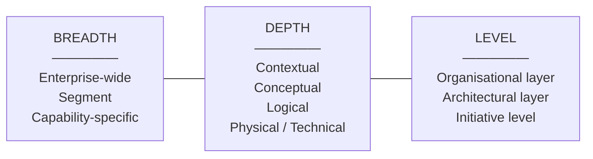

### Four EA Engagement Contexts (DPBoK)

These four contexts describe the scale and purpose of the EA engagement. **Context I** is the most tactical — an EA team embedded within a project team helping deliver a specific solution. **Context IV** is the most strategic — an enduring EA capability that shapes the entire organisation's long-term direction. Most organisations operate across multiple contexts simultaneously.

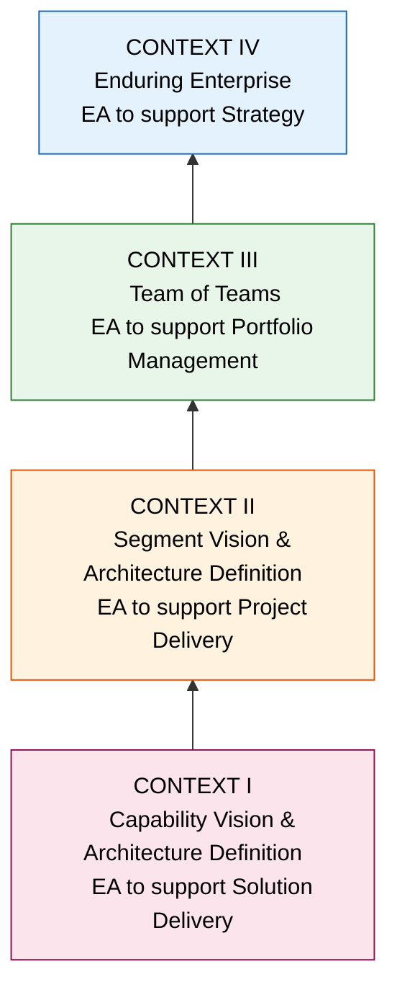

---

## 4. Architecture Abstraction Levels

When designing architecture, different stakeholders need different levels of detail. A CEO needs to understand *why* the organisation is changing; a developer needs to know *exactly what* to build. TOGAF addresses this with **four abstraction levels** — a progression from the most abstract (big picture) down to the most concrete (implementation-ready).

Each level builds on the one above it. You cannot define a meaningful logical design without first agreeing on the conceptual model, and you cannot agree on the conceptual model without first understanding the contextual drivers. Moving down the stack means adding more detail and fewer options; moving back up means questioning assumptions.

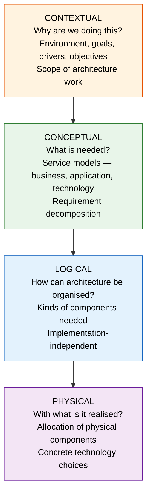

| Level | Key Question | Primary ADM Use |
|---|---|---|
| **Contextual** | Why? | Phase P & A — scope & motivation |
| **Conceptual** | What? | Phase A & B — service models |
| **Logical** | How organised? | Phases B, C, D — architecture design |
| **Physical** | With what? | Phases E & F — solution realisation |

---

## 5. Architecture Building Blocks (ABBs & SBBs)

One of TOGAF's most powerful ideas is that architecture can be assembled from **reusable components** — called Building Blocks — rather than designed from scratch every time. This is exactly the same principle as software libraries, LEGO bricks, or modular construction: define a component once, test it, and reuse it across many contexts.

An **Architecture Building Block (ABB)** is a logical, abstract description of a capability — it says *what* the architecture needs (e.g. "an identity management service") without specifying *how* it will be built. A **Solution Building Block (SBB)** is the concrete realisation — the actual product, technology, or system that fulfils the ABB (e.g. "Microsoft Entra ID"). The same ABB can be fulfilled by different SBBs in different contexts, making the architecture flexible and vendor-neutral at the design level.

Building Blocks are organised in a **hierarchy** from highly specific (custom-built for a particular capability) down to generic foundation blocks that are reusable across many organisations and industries.

### ABB vs. SBB

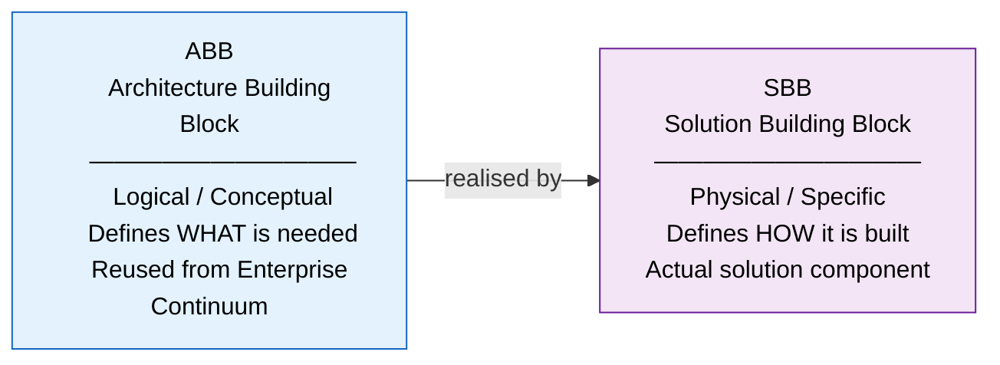

### Building Block Hierarchy (Naval Vessel Example)

The hierarchy is illustrated using a naval vessel. Level 1 is the most specific (a particular ship class), while Level 4 contains the most generic, reusable foundation blocks that could apply across many industries. When building a new architecture, you start by checking whether suitable blocks already exist at Level 4 or 3 before investing in custom Level 1 or 2 work.

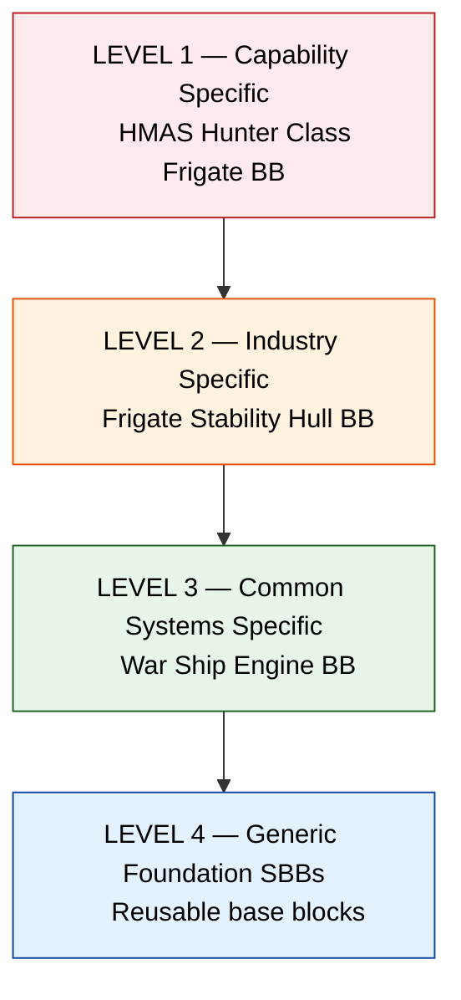

**Key principles:**
- Blocks are **reused** from the Enterprise Continuum repository, saving time and ensuring consistency
- Blocks can be **composed** into larger Superblocks for complex capabilities
- The goal is **SMART** Building Blocks — only the blocks genuinely needed to realise the Target Architecture are selected, keeping the A.D.D. focused and deliverable

---

## 6. Key Deliverables & Artefacts

Architecture work produces tangible outputs at each stage of the ADM. These **deliverables** serve two purposes: they communicate the architecture to stakeholders, and they create a formal record that governs what gets built and how. Without these artefacts, architecture work becomes invisible and ungovernable.

The most important deliverable is the **Architecture Definition Document (A.D.D.)** — the central record of the architecture design. It starts as a rough draft (v0.1) during the early phases and is progressively refined through stakeholder review and sign-off until it becomes the Approved Version (v1.0) that authorises implementation. The **Implementation & Migration Plan (I&MP)** then translates the approved architecture into a concrete roadmap of projects and work packages.

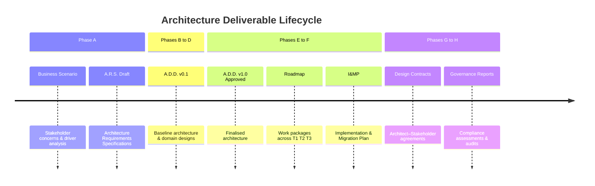

| Deliverable | Phase | Purpose |
|---|---|---|
| **A.R.S.** — Architecture Requirements Specs | A | Capture and track requirements per phase |
| **A.D.D.** — Architecture Definition Document | A–D | Central architecture design record |
| **I&MP** — Implementation & Migration Plan | F | Work packages, projects, transition steps |
| **Architecture Design & Definition Contracts** | G | Govern delivery between architects & business |
| **Roadmap** | F | Work packages organised across T1, T2, T3 |

---

## 7. RAW vs. SAW

When beginning an architecture engagement, the initial picture of "all the work that needs to be done" is often enormous. This full, unfiltered view is called the **Required Architecture Work (RAW)**. If you tried to deliver all of it at once, the programme would be unmanageable.

**Scoped Architecture Work (SAW)** is the filtered, realistic subset — the portion of the RAW that has been prioritised, risk-assessed, and approved for actual delivery. The process of moving from RAW to SAW involves negotiation with stakeholders, application of principles, and trade-off analysis. Exceptions arise when something in the RAW does not fit neatly into the SAW — these feed back into an updated RAW (version 1.1) for future consideration.

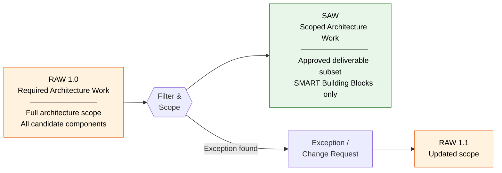

> **SLA BB** (Service Level Agreement Building Block) is formally defined during RAW → SAW scoping, establishing the performance and service expectations for each architectural component.

---

## 8. Change Requests Driving ADM Cycles

The ADM is not triggered once and then left to run on autopilot. In practice, new architecture work is continuously initiated by **change requests** from a wide variety of sources. Understanding where these requests come from helps the EA team anticipate demand, prioritise work, and ensure that architectural governance is applied consistently.

Some triggers are top-down (a new strategy from the board), others are bottom-up (a developer discovers a better way to structure a system), and others come from outside the organisation altogether (a new regulation, a market disruption, or a technology shift). All eight trigger types ultimately feed into the same ADM process.

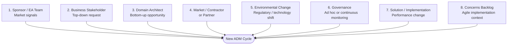

---

## 9. Phase E vs. Phase F Objectives

Phases E and F are often misunderstood as being the same thing because they both deal with "getting to implementation." In reality, they serve very different purposes and must be kept distinct.

**Phase E (Opportunities & Solutions)** is an analytical phase — its job is to survey the landscape of possible solutions, check whether candidate building blocks are interoperable, and select the best options. It is the "what could we build?" phase. **Phase F (Migration Planning)** is a planning phase — it takes the decisions made in Phase E and turns them into a concrete, time-sequenced roadmap. It is the "how do we actually get there, and in what order?" phase. Skipping straight to Phase F without Phase E risks committing to a plan that is built on incompatible or poorly evaluated components.

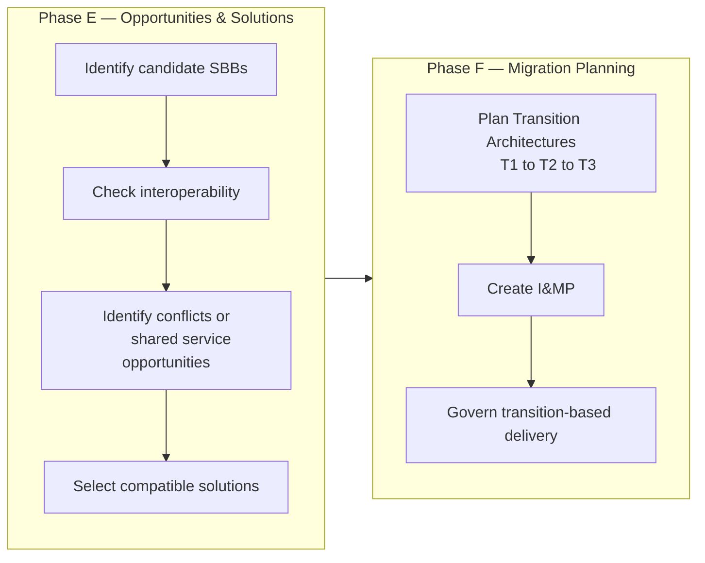

Phase E evaluates solutions against the **SBB Compatibility Stack** — preferring generic, reusable components before committing to organisation-specific custom builds:

```
Foundation  →  Common  →  System  →  Industry  →  Organisation-Specific
```

---

## 10. Transition Architecture Planning

Transforming a large enterprise from its current state (the Baseline Architecture) to a desired future state (the Target Architecture) is rarely achievable in a single leap. The gap is typically too large, too risky, and too complex to cross all at once. **Transition Architectures** solve this problem by defining a series of intermediate waypoints — T1, T2, T3 — each of which is a coherent, deployable architecture in its own right.

Each transition delivers a complete slice across all four BDAT domains simultaneously. This is important: you cannot move the Technology Architecture forward while leaving the Business Architecture behind, because they are interdependent. The Gantt chart below illustrates how all four domains move in lockstep through each transition.

```mermaid
gantt
    title Transition Architecture Delivery — BDAT Slices
    dateFormat  X
    axisFormat  T%s

    section Business
    Baseline       :done,    b0, 0, 1
    T1 Business    :active,  b1, 1, 4
    T2 Business    :         b2, 4, 7
    T3 Target      :         b3, 7, 10

    section Data
    Baseline       :done,    d0, 0, 1
    T1 Data        :active,  d1, 1, 4
    T2 Data        :         d2, 4, 7
    T3 Target      :         d3, 7, 10

    section Application
    Baseline       :done,    a0, 0, 1
    T1 App         :active,  a1, 1, 4
    T2 App         :         a2, 4, 7
    T3 Target      :         a3, 7, 10

    section Technology
    Baseline       :done,    t0, 0, 1
    T1 Tech        :active,  t1, 1, 4
    T2 Tech        :         t2, 4, 7
    T3 Target      :         t3, 7, 10
```

### Build Patterns

The architecture team can choose from different delivery patterns depending on the nature of the work. **Greenfield** builds start from nothing — highest risk and cost, but maximum freedom. **Quick Win** increments target early, visible value to build stakeholder confidence. **Reuse/Repeat** patterns (like the Barracuda Class example from the source material) are the most efficient: a design is created once and then deployed multiple times with minor variations.

| Pattern | Description | Example |
|---|---|---|
| **Greenfield** | New build from scratch | New platform deployment |
| **Quick Win** | Near-term, lower-risk | Achievable first increment |
| **Mainstream** | Core enterprise transformation | Primary delivery stream |
| **Reuse / Repeat** | Plan once, build many | Barracuda Class pattern |

---

## 11. Agile EA vs. Traditional EA

A common misconception is that TOGAF is inherently slow and bureaucratic — better suited to traditional waterfall projects than to fast-moving digital organisations. This is a misreading. TOGAF explicitly supports both predictive (traditional) and agile delivery styles, and provides a model for choosing the right approach based on the nature of the project.

The decision matrix below uses two axes: **how frequently** the organisation needs to deliver changes, and **how much the architecture changes** with each delivery. Projects in the bottom-left (infrequent, low-change) are best managed predictively. Projects in the top-right (frequent, high-change) suit agile methods. The skill of an Enterprise Architect is recognising which quadrant a given initiative sits in — and tailoring the ADM engagement accordingly.

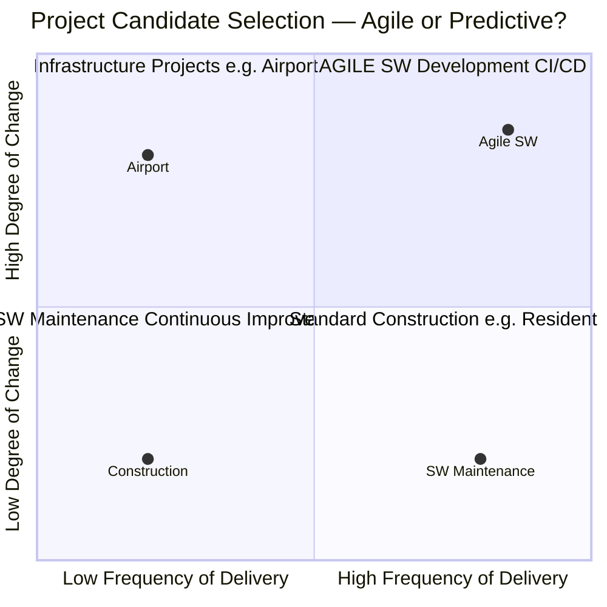

| Approach | Best For | ADM Style |
|---|---|---|
| **Predictive** | Large infrastructure, low iteration | Full ADM cycle, single pass |
| **Agile / Iterative** | Software-intensive, high-change | Incremental ADM iterations |
| **Transition-based** | Bridge between both | Multiple defined increments T1, T2, T3 |

---

## 12. Enterprise Security Architecture

Security is often treated as an afterthought in architecture — bolted on at the end when the design is already finalised. TOGAF takes a different view: **security is a parallel, continuous concern** that must be considered at every phase of the ADM, not just during implementation.

The Security Architecture track runs alongside the main ADM phases. At each phase, the security architect is asking: "What are the security implications of this design decision? What risks are we introducing? What controls are needed?" The outputs — a Risks Catalogue, a live Risks Register, and compliance assessments — are maintained and updated throughout the entire cycle. This ensures that by the time the architecture reaches implementation, security has been designed in, not patched on.

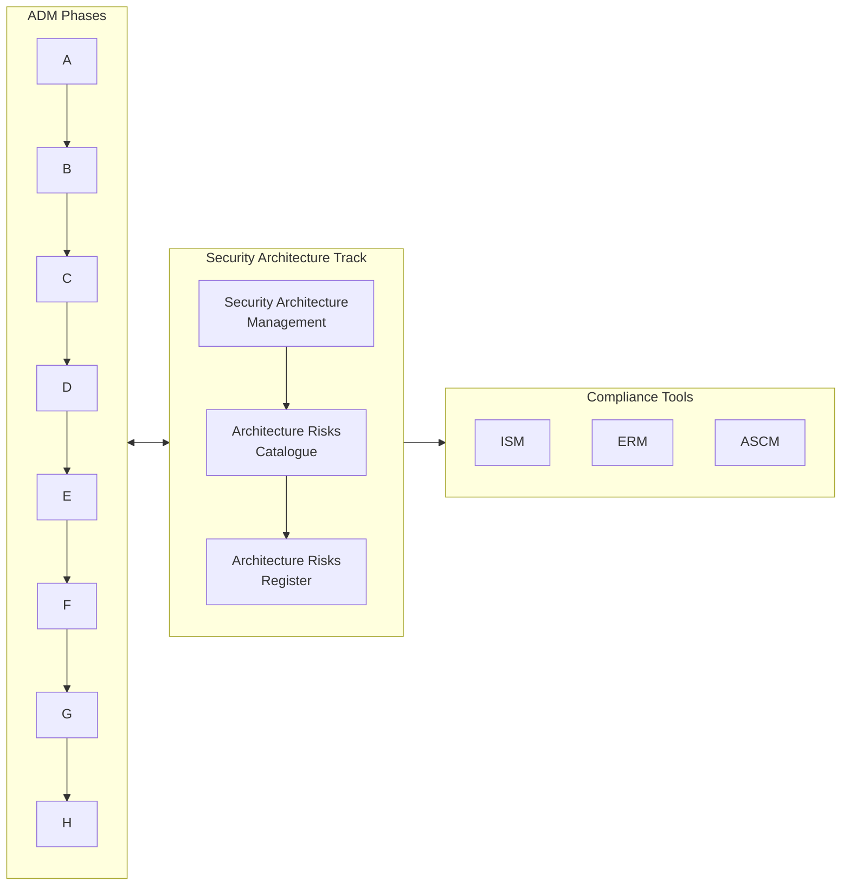

---

## 13. Repository & Enterprise Continuum

The **Architecture Repository** is the institutional memory of the EA function. It stores every architecture artefact produced across all ADM cycles — requirements, risks, designs, and reusable building blocks — making them available for future work. Without a well-maintained repository, organisations reinvent the wheel with every new project and lose the accumulated value of past architectural decisions.

The **Enterprise Continuum** is the classification system within the repository for building blocks. It organises blocks on a spectrum from the most generic (Foundation Architecture — applicable to any organisation) to the most specific (Organisation-Specific Architecture — custom to your enterprise). When starting new architecture work, architects first search the Continuum for reusable blocks before creating new ones.

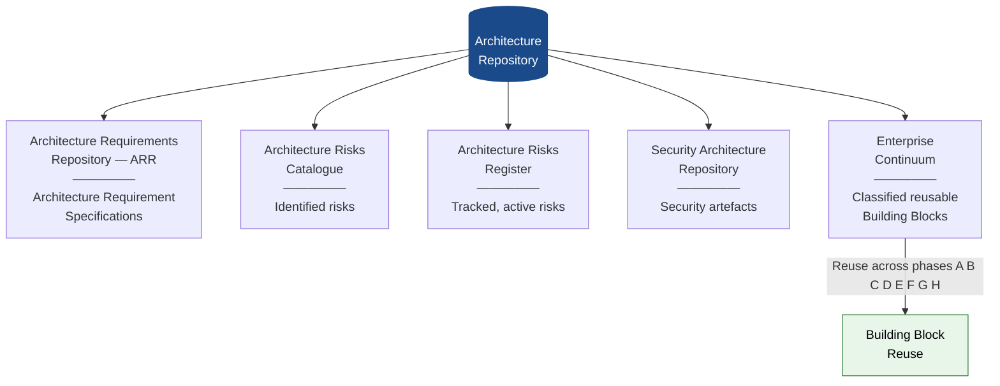

---

## 14. Business Scenarios

One of the most common failure modes in architecture is designing a solution to the wrong problem. This happens when architects work in isolation, translating a brief into technical designs without sufficiently understanding the business context. **Business Scenarios** are TOGAF's mechanism for preventing this.

A Business Scenario is a structured conversation between the Architecture Team and business stakeholders. Its purpose is to uncover the real drivers, constraints, and needs behind a request — before any design decisions are made. It produces requirements across all five architecture domains (Business, Data, Application, Technology, and Security), ensuring nothing is overlooked. These requirements then flow directly into the Architecture Requirement Specifications (A.R.S.) that govern the rest of the ADM cycle.

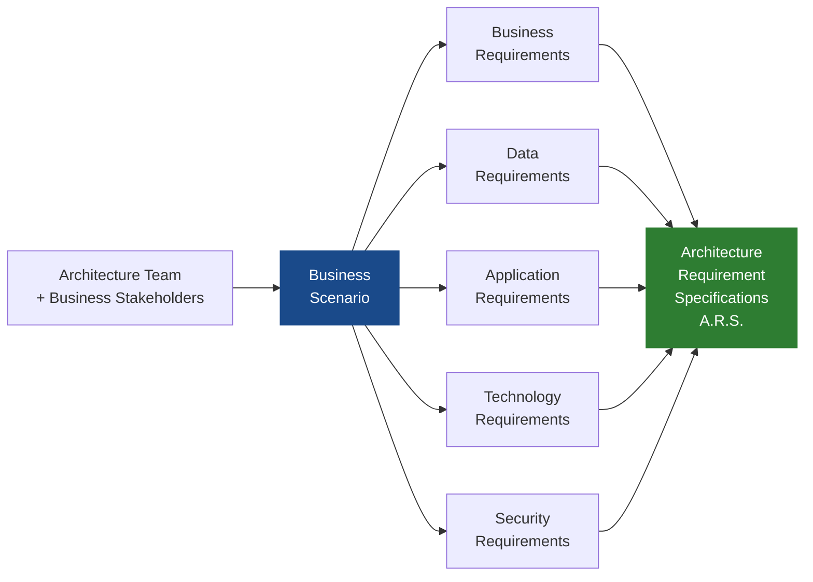

---

## 15. TOGAF® EA Viewpoints Library (10th Edition)

Architecture is complex — no single diagram can communicate everything to every stakeholder. A CEO needs a value stream map; a DBA needs a data entity diagram; a network engineer needs a platform decomposition diagram. The **Viewpoints Library** is TOGAF's answer to this challenge: a structured catalogue of standardised views, each designed to communicate a specific aspect of the architecture to a specific audience.

The 10th Edition significantly expanded the library, particularly in the Business Architecture domain, adding new viewpoints for Business Models, Business Capability Maps, and Value Stream Maps. Each domain (Preliminary, Business, Data, Application, Technology) provides three types of views: **Catalogs** (inventories), **Matrices** (cross-domain relationships), and **Diagrams** (visual representations).

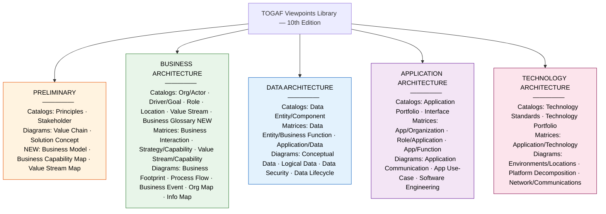

### Viewpoint Types Explained

| Type | Purpose | Examples |
|---|---|---|
| **Catalogs** | Complete inventories of architecture elements | Org/Actor Catalog, Technology Portfolio |
| **Matrices** | Map cross-domain relationships and dependencies | Application/Technology Matrix |
| **Diagrams** | Visual representations for specific audiences | Process Flow, Platform Decomposition |

---

## 16. Foundation Metamodel

The **Metamodel** is TOGAF's formal vocabulary — a precise definition of every type of architectural entity and how they relate to each other. It answers the question: "When we talk about a Business Capability, a Process, or a Technology Service, what exactly do we mean, and how do these concepts connect?"

Without a shared metamodel, architecture teams in different parts of the organisation use the same words to mean different things, making it impossible to integrate work across teams or compare architectures. The metamodel enforces consistency. It defines **General Entities** (like Principles, Requirements, and Gaps) that apply everywhere, and **domain-specific entities** for each of the four architecture domains. The most critical cross-domain relationship is the chain from Business Service → Application Service → Technology Service, which traces how business needs are ultimately supported by technology.

### General Entities (cross-domain)

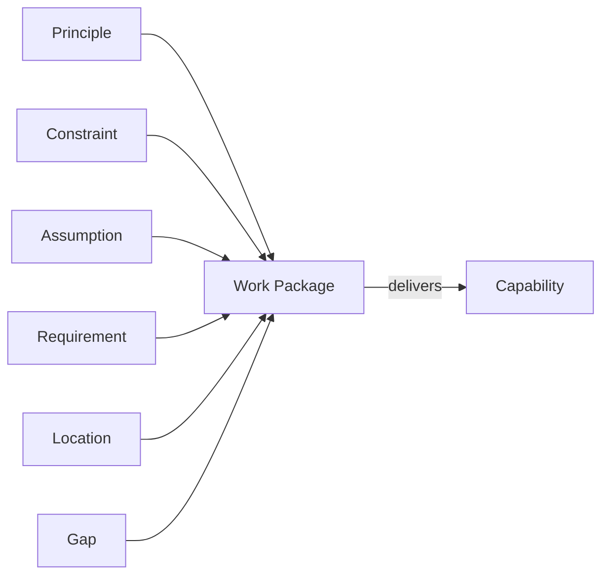

### Business Architecture Entities

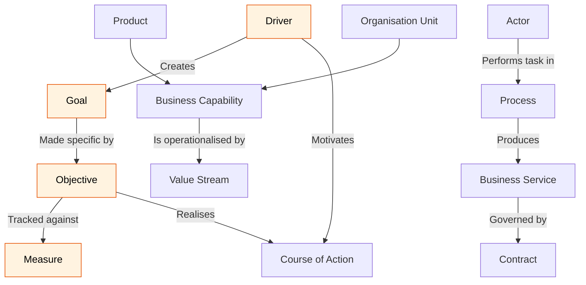

### Cross-Domain Relationships

```mermaid
flowchart LR
    subgraph BIZ ["Business Architecture"]
        BS2["Business Service"]
    end

    subgraph APP ["Application Architecture"]
        AS["Application Service"]
        LAC["Logical Application Component"]
        PAC["Physical Application Component"]
        LAC -->|"realised by"| PAC
    end

    subgraph DATA ["Data Architecture"]
        DE["Data Entity"]
        LDC["Logical Data Component"]
        PDC["Physical Data Component"]
        DE -->|"resides in"| LDC -->|"realised by"| PDC
    end

    subgraph TECH ["Technology Architecture"]
        TS["Technology Service"]
        LTC["Logical Technology Component"]
        PTC["Physical Technology Component"]
        LTC -->|"realised by"| PTC
    end

    BS2 -->|"automates"| AS
    AS -->|"implemented on"| TS

    style BIZ fill:#E8F5E9,stroke:#2E7D32,color:#000
    style APP fill:#F3E5F5,stroke:#6A1B9A,color:#000
    style DATA fill:#E3F2FD,stroke:#1565C0,color:#000
    style TECH fill:#FCE4EC,stroke:#880E4F,color:#000
```

---

## 17. Content Framework by ADM Phase

The Content Framework maps the types of architecture work — and the level of detail expected — to each ADM phase. It answers a practical question that every architect faces: "At this stage of the project, what should my architecture documents actually contain?"

Early phases (A) produce high-level, contextual and conceptual artefacts — visions and scenarios, not detailed designs. The middle phases (B, C, D) produce logical designs — detailed enough to guide decisions, but still technology-agnostic. Phases E and F move into physical design, where specific products and vendors are selected. Finally, Phases G and H shift the focus away from design entirely, towards governance, compliance, and change management.

```mermaid
flowchart LR
    subgraph CONTEXT ["Contextual & Conceptual"]
        PA["Phase A
        Architecture Vision
        Business Scenarios
        A.R.S. spawned"]
    end

    subgraph LOGICAL ["Logical Design — v0.1 Drafts"]
        PB["Phase B
        Business Architecture"]
        PC["Phase C
        Data & Application"]
        PD["Phase D
        Technology Architecture"]
        PB --> PC --> PD
    end

    subgraph PHYSICAL ["Physical Design & Roadmap"]
        PE["Phase E
        Opportunities & Solutions
        SBB selection"]
        PF["Phase F
        Migration Planning
        I&MP and Roadmap"]
        PE --> PF
    end

    subgraph GOVERNANCE ["Governance & Change"]
        PG["Phase G
        Implementation Governance
        Compliance"]
        PH["Phase H
        Change Management
        Re-iteration"]
        PG --> PH
    end

    CONTEXT --> LOGICAL --> PHYSICAL --> GOVERNANCE

    style CONTEXT fill:#FFF3E0,stroke:#E65100,color:#000
    style LOGICAL fill:#E3F2FD,stroke:#1565C0,color:#000
    style PHYSICAL fill:#E8F5E9,stroke:#2E7D32,color:#000
    style GOVERNANCE fill:#F3E5F5,stroke:#6A1B9A,color:#000
```

### Metamodel Levels

| Level | Focus |
|---|---|
| **Level 1** — Foundation Metamodel | Core entity types and relationships across all four domains |
| **Level 2** — Extended Metamodel | Additional relationships and domain-specific entities |

---

## 18. Classes of Architecture Engagement

Not all architecture work is the same, and applying a full enterprise architecture process to every change — regardless of scale — would be wasteful and impractical. TOGAF's **Classes of Architecture Engagement** provide a framework for calibrating the level of EA involvement to the nature of the change.

The class is determined by three questions: *Why* is the change occurring (what is the driver)? *When and how often* does it need to happen (frequency and urgency)? *What* is the scope and nature of the change (architectural impact)? The answers to these questions determine which ADM phases to emphasise, how formal the governance process should be, and whether the engagement is best handled by a full EA team or a lighter-touch advisory function.

```mermaid
flowchart TD
    WHY{"WHY is the
    change occurring?"}

    WHEN{"WHEN / HOW OFTEN
    is it needed?"}

    WHAT{"WHAT is the
    scope & nature?"}

    WHY --> CLASS["Class of Architecture Engagement"]
    WHEN --> CLASS
    WHAT --> CLASS

    CLASS --> EMP["Which ADM phases
    to emphasise"]
    CLASS --> TAIL["How to tailor
    the engagement model"]
    CLASS --> GOV2["Governance
    approach"]

    style CLASS fill:#1A4A8A,stroke:#1A4A8A,color:#fff
```

The engagement class determines how the ADM is applied — from lightweight advisory work on a small initiative through to a full enterprise re-architecture programme spanning multiple years.

---
