# TOGAF® EA — Visual Study Notes

  

> Based on the **TOGAF® Standard, 10th Edition** 

---

## Table of Contents

| # | Section | Key Concept |
|:--|---------|-------------|
| 1 | [What is TOGAF?](#1-what-is-togaf) | Framework overview & four domains |
| 2 | [The ADM Cycle](#2-the-architecture-development-method-adm) | Core phases, iterations, change types |
| 3 | [Architecture Scoping](#3-architecture-scoping) | Breadth, depth, level & EA contexts |
| 4 | [Abstraction Levels](#4-architecture-abstraction-levels) | Contextual → Conceptual → Logical → Physical |
| 5 | [Building Blocks](#5-architecture-building-blocks-abbs--sbbs) | ABBs, SBBs, hierarchy |
| 6 | [Key Deliverables](#6-key-deliverables--artefacts) | A.D.D., I&MP, Roadmap |
| 7 | [RAW vs. SAW](#7-raw-vs-saw) | Scoping & filtering architecture work |
| 8 | [Change Requests](#8-change-requests-driving-adm-cycles) | Eight triggers for new ADM cycles |
| 9 | [Phase E vs. F](#9-phase-e-vs-phase-f-objectives) | Opportunities vs. Migration Planning |
| 10 | [Transition Architecture](#10-transition-architecture-planning) | T1 → T2 → T3 build patterns |
| 11 | [Agile EA](#11-agile-ea-vs-traditional-ea) | Decision matrix |
| 12 | [Security Architecture](#12-enterprise-security-architecture) | Security across the ADM |
| 13 | [Repository & Continuum](#13-repository--enterprise-continuum) | Reuse & storage |
| 14 | [Business Scenarios](#14-business-scenarios) | Capturing requirements |
| 15 | [Viewpoints Library](#15-togaf-ea-viewpoints-library-10th-edition) | Catalogs, matrices, diagrams |
| 16 | [Foundation Metamodel](#16-foundation-metamodel) | Entity relationships |
| 17 | [Content Framework](#17-content-framework-by-adm-phase) | Metamodel levels by phase |
| 18 | [Classes of Engagement](#18-classes-of-architecture-engagement) | Why / when / what |

---

## 1. What is TOGAF?

**TOGAF** (The Open Group Architecture Framework) provides a structured approach to designing, planning, implementing, and governing enterprise information architecture.

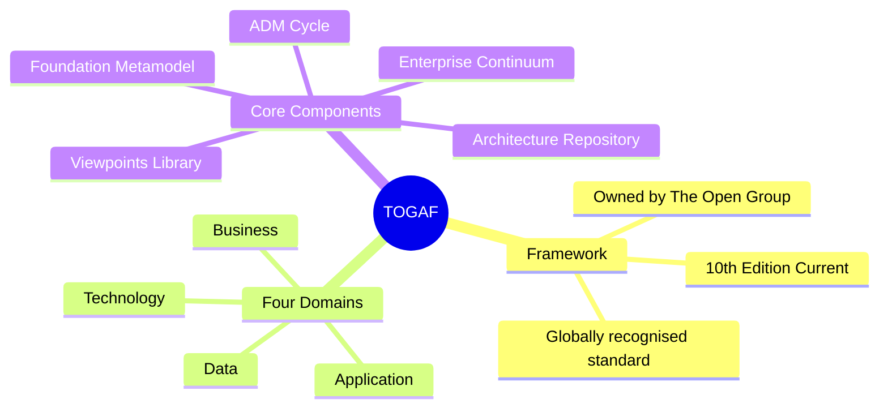

---

## 2. The Architecture Development Method (ADM)

The ADM is the **core iterative process** of TOGAF — a structured cycle of phases for developing and managing enterprise architecture.

### ADM Phase Flow

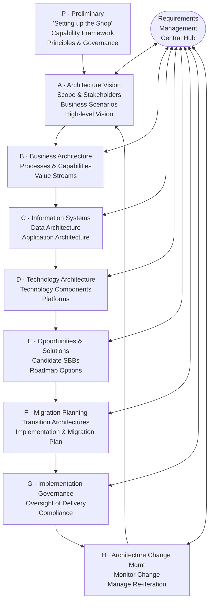

### ADM Iteration Types

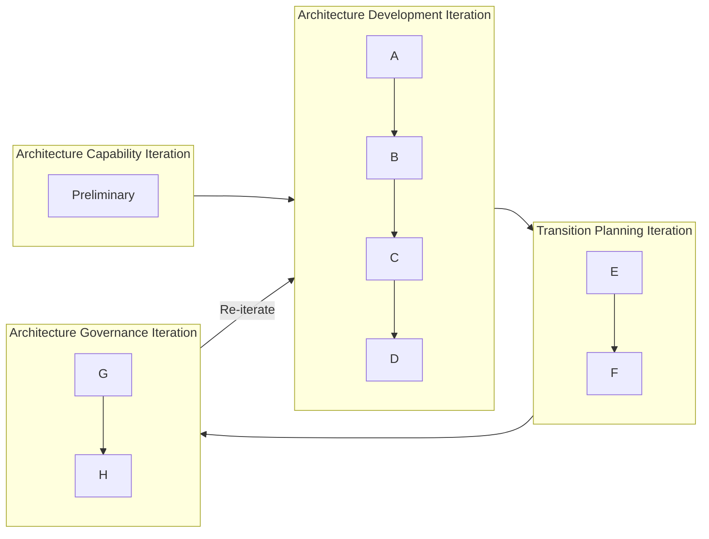

### Reiteration & Change Types

| Change Type | Description | ADM Impact |
|---|---|---|
| **RE-Architecture** | Major structural change | Back to Phase A or Preliminary |
| **Large Incremental** | More than one phase rework | Multi-phase reiteration |
| **Simplification** | Small incremental change | Rework within a single phase |
| **General Change Management** | Ongoing governance | Phases G & H |

> **Phase G** handles: process reviews, audits, compliance assessments, disciplinary processes, dispensations, exemptions.
>
> **Phase H** handles: re-architecture decisions, large incremental changes.

---

## 3. Architecture Scoping

Architecture scope is defined across **three dimensions**:

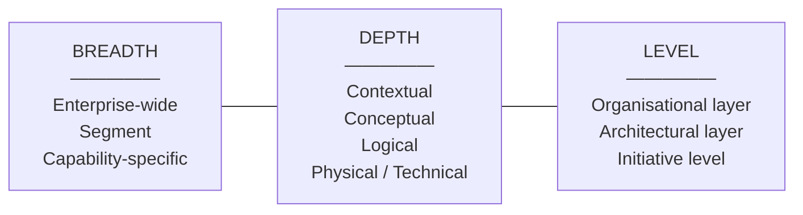

### Four EA Engagement Contexts (DPBoK)

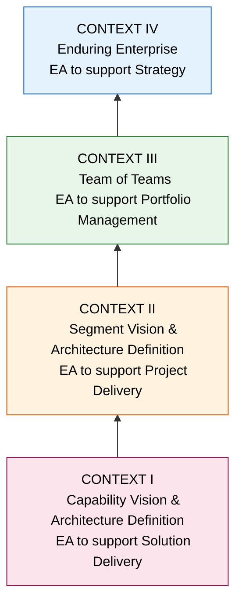

---

## 4. Architecture Abstraction Levels

TOGAF defines **four abstraction levels** that apply across all ADM phases:

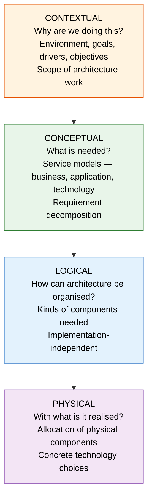

| Level | Key Question | Primary ADM Use |
|---|---|---|
| **Contextual** | Why? | Phase P & A — scope & motivation |
| **Conceptual** | What? | Phase A & B — service models |
| **Logical** | How organised? | Phases B, C, D — architecture design |
| **Physical** | With what? | Phases E & F — solution realisation |

---

## 5. Architecture Building Blocks (ABBs & SBBs)

Building Blocks are **reusable, composable units** of architecture capability.

### ABB vs. SBB

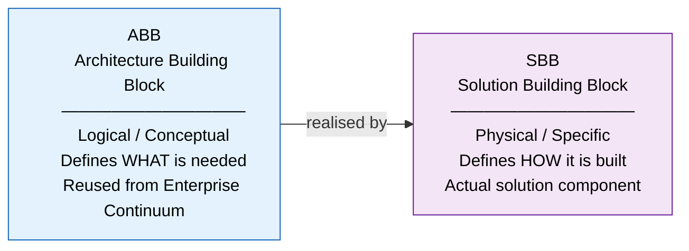

### Building Block Hierarchy (Naval Vessel Example)

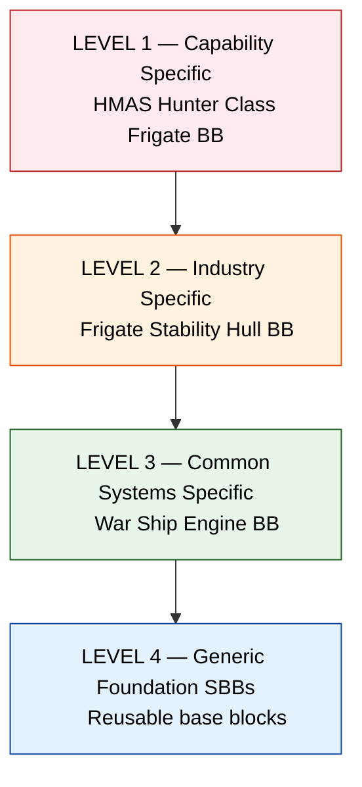

### Key Principles

- Blocks are **reused** from the Enterprise Continuum repository
- Blocks can be **composed** into Superblocks
- Goal: **SMART** Building Blocks — filtered to only what is needed to realise the Target Architecture via the **A.D.D.**

---

## 6. Key Deliverables & Artefacts

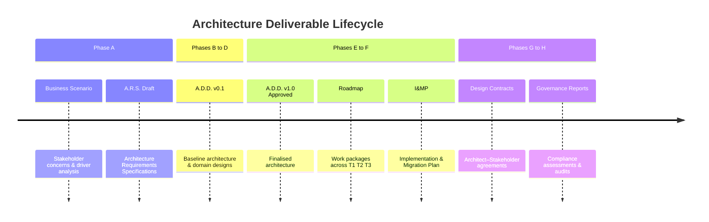

| Deliverable | Phase | Purpose |
|---|---|---|
| **A.R.S.** — Architecture Requirements Specs | A | Capture requirements per phase |
| **A.D.D.** — Architecture Definition Document | A–D | Central architecture design record |
| **I&MP** — Implementation & Migration Plan | F | Work packages, projects, transition steps |
| **Architecture Design & Definition Contracts** | G | Govern delivery between architects & business |
| **Roadmap** | F | Work packages organised across T1, T2, T3 |

---

## 7. RAW vs. SAW

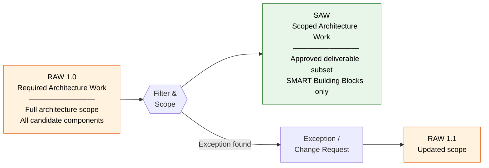

> **SLA BB** (Service Level Agreement Building Block) is defined during RAW → SAW scoping.

---

## 8. Change Requests Driving ADM Cycles

New ADM cycles can be triggered by **eight sources**:


---

## 9. Phase E vs. Phase F Objectives

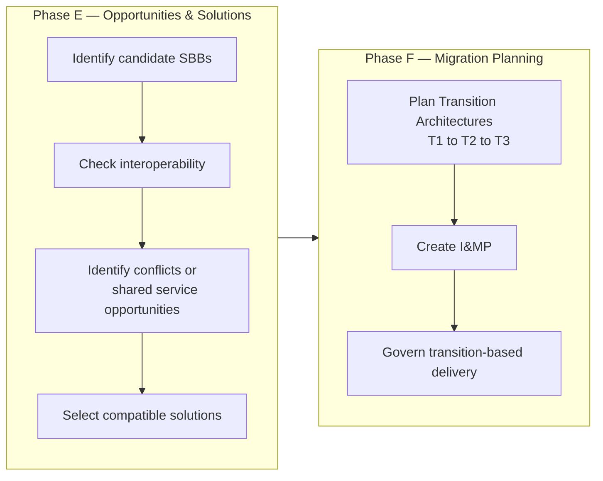

Phase E uses the **SBB Compatibility Stack** to assess solutions:

```
Foundation  →  Common  →  System  →  Industry  →  Organisation-Specific
```

---

## 10. Transition Architecture Planning

Transition Architectures (T1, T2, T3…) are **intermediate target states** between baseline and full target.

```mermaid
gantt
    title Transition Architecture Delivery — BDAT Slices
    dateFormat  X
    axisFormat  T%s

    section Business
    Baseline       :done,    b0, 0, 1
    T1 Business    :active,  b1, 1, 4
    T2 Business    :         b2, 4, 7
    T3 Target      :         b3, 7, 10

    section Data
    Baseline       :done,    d0, 0, 1
    T1 Data        :active,  d1, 1, 4
    T2 Data        :         d2, 4, 7
    T3 Target      :         d3, 7, 10

    section Application
    Baseline       :done,    a0, 0, 1
    T1 App         :active,  a1, 1, 4
    T2 App         :         a2, 4, 7
    T3 Target      :         a3, 7, 10

    section Technology
    Baseline       :done,    t0, 0, 1
    T1 Tech        :active,  t1, 1, 4
    T2 Tech        :         t2, 4, 7
    T3 Target      :         t3, 7, 10
```

### Build Patterns

| Pattern | Description | Example |
|---|---|---|
| **Greenfield** | New build from scratch | New platform deployment |
| **Quick Win** | Near-term, lower-risk | Achievable first increment |
| **Mainstream** | Core enterprise transformation | Primary delivery stream |
| **Reuse / Repeat** | Plan once, build many | Barracuda Class pattern |

---

## 11. Agile EA vs. Traditional EA

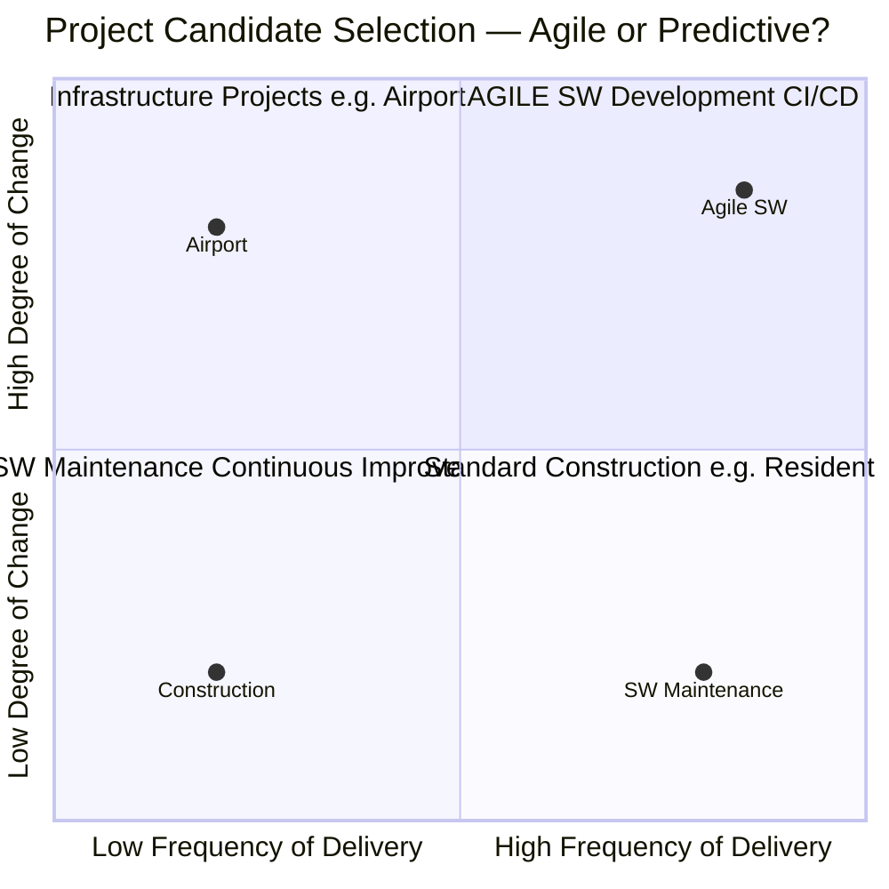

| Approach | Best For | ADM Style |
|---|---|---|
| **Predictive** | Large infrastructure, low iteration | Full ADM cycle, single pass |
| **Agile / Iterative** | Software-intensive, high-change | Incremental ADM iterations |
| **Transition-based** | Bridge between both | Multiple defined increments T1, T2, T3 |

---

## 12. Enterprise Security Architecture

Security is a **parallel track** woven throughout the entire ADM — not a separate phase.

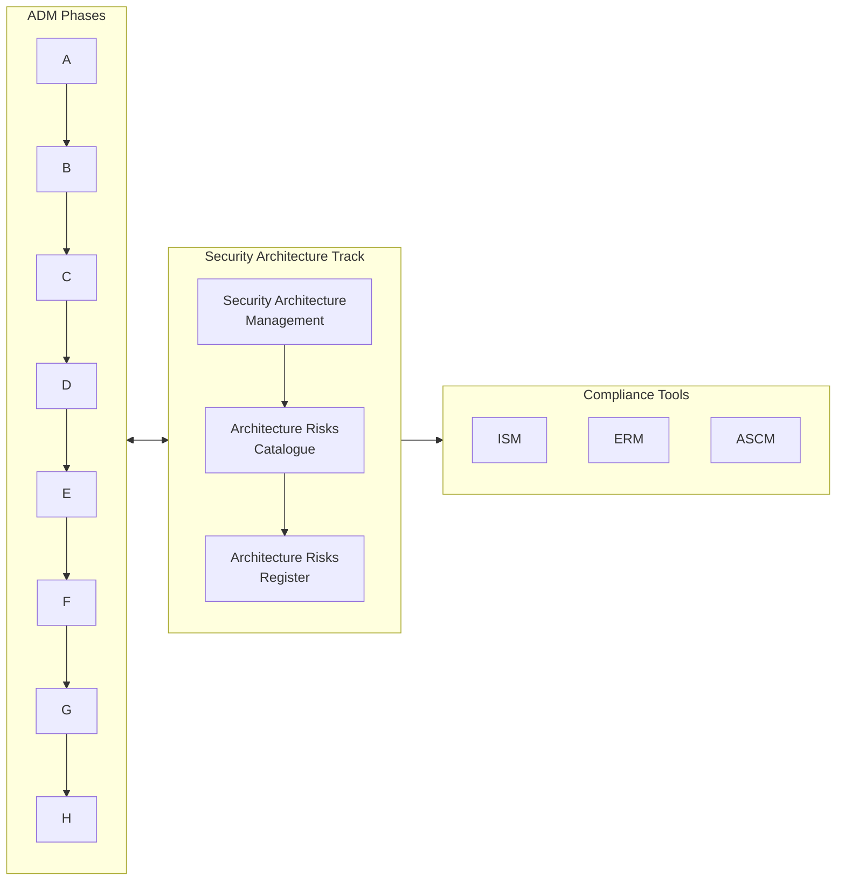

---

## 13. Repository & Enterprise Continuum

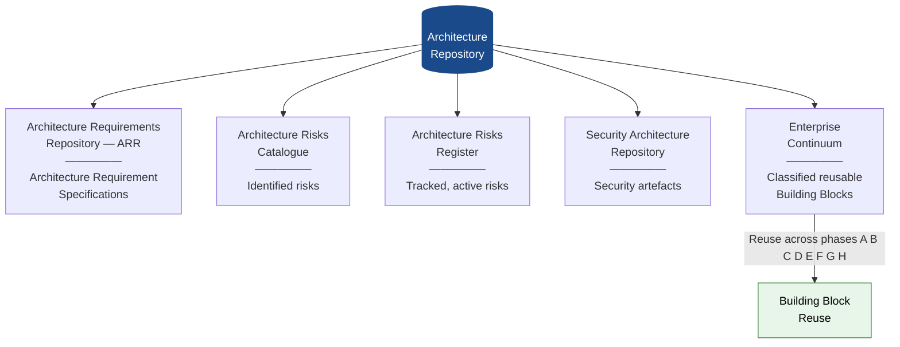

---

## 14. Business Scenarios

A **Business Scenario** is used in Phase A (and referenced throughout) to translate stakeholder concerns into architecture requirements.

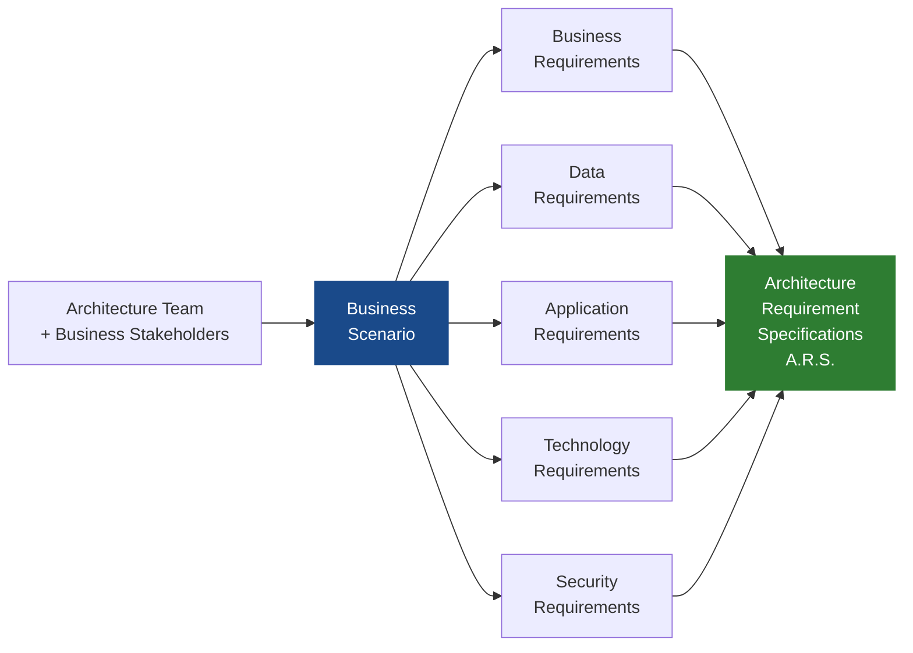

---

## 15. TOGAF® EA Viewpoints Library (10th Edition)

The 10th Edition significantly expanded the viewpoints library across five architecture domains.

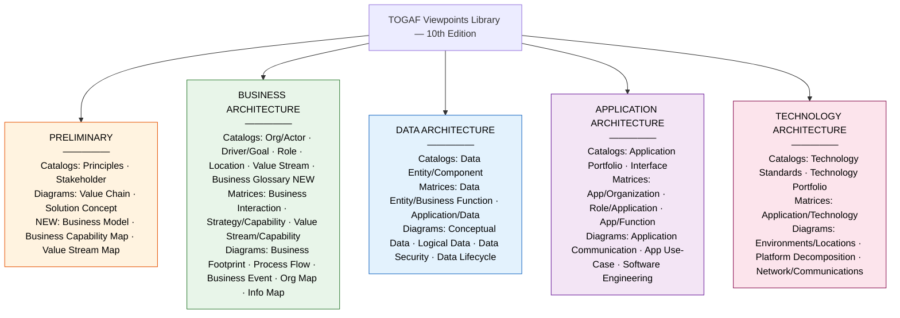

### Viewpoint Types Explained

| Type | Purpose | Examples |
|---|---|---|
| **Catalogs** | Inventories of architecture elements | Org/Actor Catalog, Technology Portfolio |
| **Matrices** | Cross-domain relationships | Application/Technology Matrix |
| **Diagrams** | Visual representations of architecture | Process Flow, Platform Decomposition |

---

## 16. Foundation Metamodel

The **TOGAF Enterprise Metamodel** defines relationships between all architectural entities.

### General Entities (cross-domain)

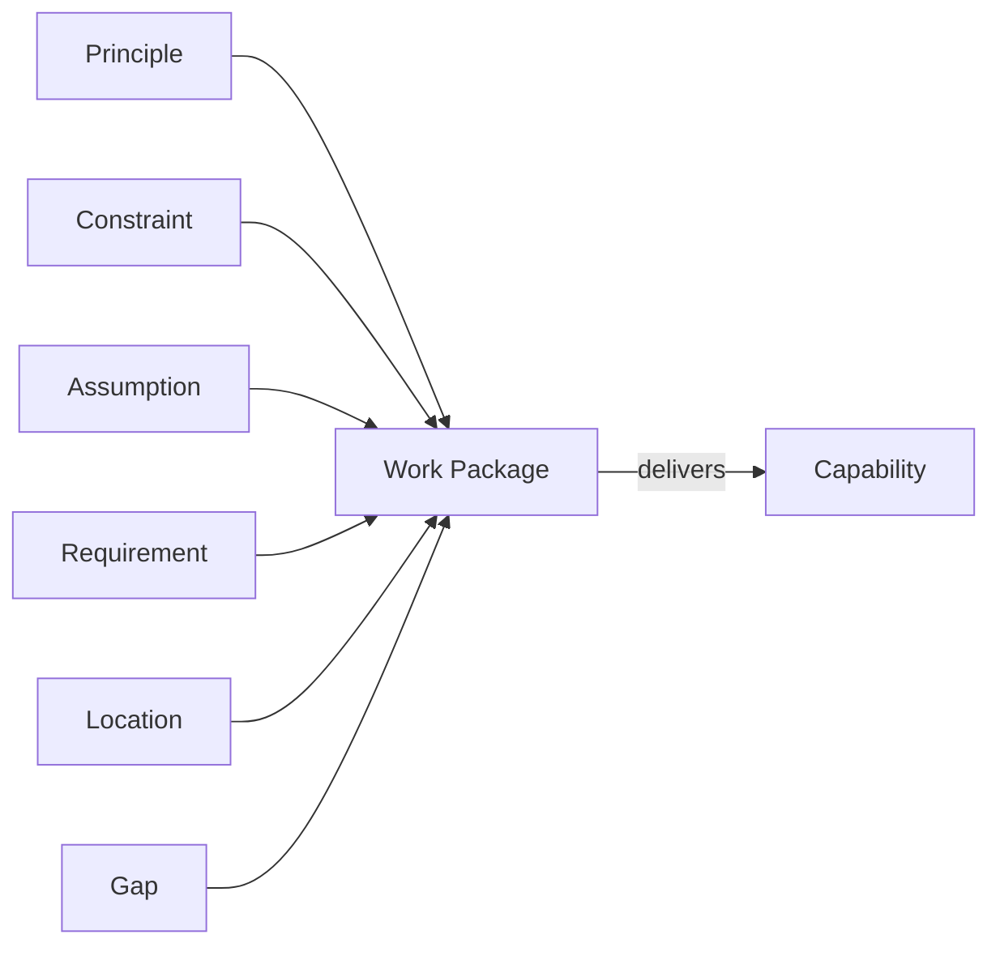

### Business Architecture Entities

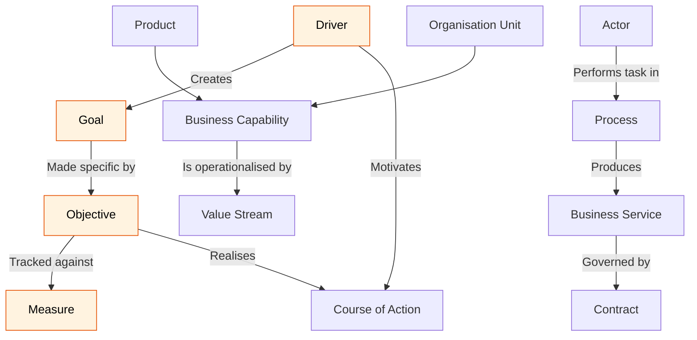

### Cross-Domain Relationships

```mermaid
flowchart LR
    subgraph BIZ ["Business Architecture"]
        BS2["Business Service"]
    end

    subgraph APP ["Application Architecture"]
        AS["Application Service"]
        LAC["Logical Application Component"]
        PAC["Physical Application Component"]
        LAC -->|"realised by"| PAC
    end

    subgraph DATA ["Data Architecture"]
        DE["Data Entity"]
        LDC["Logical Data Component"]
        PDC["Physical Data Component"]
        DE -->|"resides in"| LDC -->|"realised by"| PDC
    end

    subgraph TECH ["Technology Architecture"]
        TS["Technology Service"]
        LTC["Logical Technology Component"]
        PTC["Physical Technology Component"]
        LTC -->|"realised by"| PTC
    end

    BS2 -->|"automates"| AS
    AS -->|"implemented on"| TS

    style BIZ fill:#E8F5E9,stroke:#2E7D32,color:#000
    style APP fill:#F3E5F5,stroke:#6A1B9A,color:#000
    style DATA fill:#E3F2FD,stroke:#1565C0,color:#000
    style TECH fill:#FCE4EC,stroke:#880E4F,color:#000
```

---

## 17. Content Framework by ADM Phase

```mermaid
flowchart LR
    subgraph CONTEXT ["Contextual & Conceptual"]
        PA["Phase A
        Architecture Vision
        Business Scenarios
        A.R.S. spawned"]
    end

    subgraph LOGICAL ["Logical Design — v0.1 Drafts"]
        PB["Phase B
        Business Architecture"]
        PC["Phase C
        Data & Application"]
        PD["Phase D
        Technology Architecture"]
        PB --> PC --> PD
    end

    subgraph PHYSICAL ["Physical Design & Roadmap"]
        PE["Phase E
        Opportunities & Solutions
        SBB selection"]
        PF["Phase F
        Migration Planning
        I&MP and Roadmap"]
        PE --> PF
    end

    subgraph GOVERNANCE ["Governance & Change"]
        PG["Phase G
        Implementation Governance
        Compliance"]
        PH["Phase H
        Change Management
        Re-iteration"]
        PG --> PH
    end

    CONTEXT --> LOGICAL --> PHYSICAL --> GOVERNANCE

    style CONTEXT fill:#FFF3E0,stroke:#E65100,color:#000
    style LOGICAL fill:#E3F2FD,stroke:#1565C0,color:#000
    style PHYSICAL fill:#E8F5E9,stroke:#2E7D32,color:#000
    style GOVERNANCE fill:#F3E5F5,stroke:#6A1B9A,color:#000
```

### Metamodel Levels

| Level | Focus |
|---|---|
| **Level 1** — Foundation Metamodel | Core entity types and relationships across all four domains |
| **Level 2** — Extended Metamodel | Additional relationships and domain-specific entities |

---

## 18. Classes of Architecture Engagement

TOGAF recognises different **classes of architecture change engagement**, determined by three questions:

```mermaid
flowchart TD
    WHY{"WHY is the
    change occurring?"}

    WHEN{"WHEN / HOW OFTEN
    is it needed?"}

    WHAT{"WHAT is the
    scope & nature?"}

    WHY --> CLASS["Class of Architecture Engagement"]
    WHEN --> CLASS
    WHAT --> CLASS

    CLASS --> EMP["Which ADM phases
    to emphasise"]
    CLASS --> TAIL["How to tailor
    the engagement model"]
    CLASS --> GOV2["Governance
    approach"]

    style CLASS fill:#1A4A8A,stroke:#1A4A8A,color:#fff
```

The engagement class determines how the ADM is applied — from lightweight advisory work through to full enterprise re-architecture.

---
